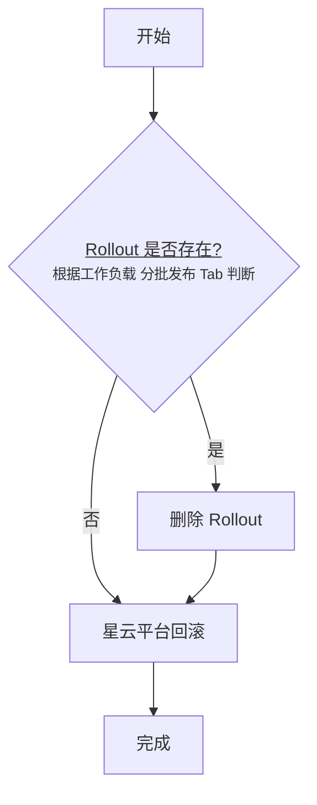

# 分批发布回滚操作指南

> **重要**：Kruise Rollout 发布后，ReplicaSet 携带特殊注解，`kubectl rollout undo` 无法回滚。

---

## 流程图



---

## 回滚步骤

### 情况一：Rollout 已删除，直接回滚

1. 进入 **分批发布 → Rollout**，确认 Rollout 不存在
2. 进入 **集群 → 工作负载** → 选择 Deployment → **历史版本** → **选择版本** → **回滚**

### 情况二：Rollout 未删除，需先删除再回滚

1. 进入 **集群 → 工作负载** → 选择 Deployment → **分批发布** 标签页
2. 找到 Rollout，点击 **⋮** → **删除**
3. 进入 **历史版本** → **选择版本** → **回滚**

> Rollout 删除后，BatchRelease 会自动级联删除

---

## 命令行操作

```bash
# 删除 Rollout
kubectl delete rollout <name> -n <namespace>

# 回滚 Deployment
kubectl rollout undo deployment/<name> -n <namespace>

# StatefulSet 回滚
kubectl patch statefulset <name> -n <namespace> \
  -p='{"spec":{"template":{"spec":{"containers":[{"name":"<container>","image":"<old-image>"}]}}}}}'
```

---

## RBAC 权限配置

```yaml
apiVersion: rbac.authorization.k8s.io/v1
kind: ClusterRole
metadata:
  name: kruise-rollout-admin
rules:
  - apiGroups: ["rollouts.kruise.io"]
    resources: ["rollouts", "batchreleases"]
    verbs: ["get", "list", "watch", "create", "update", "patch", "delete"]
  - apiGroups: ["rollouts.kruise.io"]
    resources: ["rollouts/status", "batchreleases/status"]
    verbs: ["get", "update", "patch"]
  - apiGroups: ["rollouts.kruise.io"]
    resources: ["rollouts/finalizers", "batchreleases/finalizers"]
    verbs: ["update"]
```

---

## 资源示例

### Rollout

```yaml
apiVersion: rollouts.kruise.io/v1alpha1
kind: Rollout
metadata:
  name: sre-publisher
  namespace: monitoring-prometheus
spec:
  objectRef:
    workloadRef:
      apiVersion: apps/v1
      kind: Deployment
      name: sre-publisher
  strategy:
    canary:
      paused: false
      steps:
        - replicas: 1%
        - replicas: 100%
status:
  phase: Progressing
```

### BatchRelease

```yaml
apiVersion: rollouts.kruise.io/v1alpha1
kind: BatchRelease
metadata:
  name: sre-publisher
  namespace: monitoring-prometheus
  ownerReferences:
    - apiVersion: rollouts.kruise.io/v1alpha1
      controller: true
      kind: Rollout
      name: sre-publisher
spec:
  releasePlan:
    batchPartition: 0
    batches:
      - canaryReplicas: 1%
      - canaryReplicas: 100%
  targetReference:
    workloadRef:
      apiVersion: apps/v1
      kind: Deployment
      name: sre-publisher
status:
  phase: Progressing
  currentBatch: 0
```
